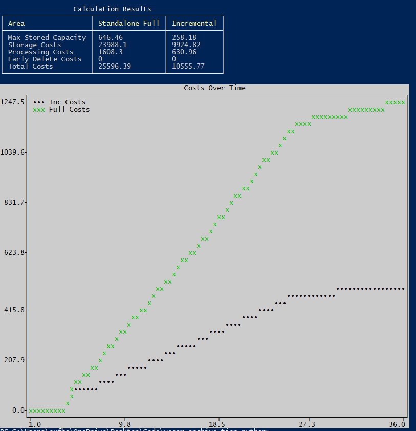

# Veeam Archive Tier Calculation

NOTE: This is independently produced and has no association with Veeam and provided under the MIT license. Use at your own risk.

This is a work in progress and is designed to allow people to see the Archive Tier code logic and comment on it. 

The code currently only supports Monthly GFS points tiered to Archive Tier.

Pull requests are welcome!

The following packages are required:

    pip install plotext rich pyyaml

The parameters can be found in the inputs.yaml file. The variables are as follows:

| variable | Description | Notes |
|----------|-------------|-------|
| source_cap | The source capacity to backup in TB | - | 
| change_rate | The change rate in decimal | - |
| growth | The per-year growth factor in decimal | - |
| scope | The years in scope | - |
| comp | The compression factor | Usually 50%, higher value equals less data stored |
| months | The quantity of months in the policy | - |
| tier_after | When tiering to Archive should happen (month) | - |
| read_fee | The cost of reading data out of the source Object Storage | - |
| retrieve_fee | This is an additional cost getting the data associated with some cloud providers | - |
| storage_fee | This is the cost of the Archive tier of storage per-GB per-month | For example S3 IA see https://aws.amazon.com/s3/pricing/ - Requests and Retrievals |
| block_size | This is the source block size in MB | Usually 1MB, but can be 4 or 8MB. This can result in higher performance and capacity tier usage |
| compute_cost | This is the cost of running the helper VM per hour | - |
| throughput | This is the estimated throughput of the VM in MBps | - |
| min_retention | This is the minimum retention of the cloud provider's Archive Tier | Usually set to either 3 or 6 months |
| change_rate_modifier | This is additional monthly overhead for monthly GFS | Changing is not recommended |

The script will produce a table and graph with the results. 

